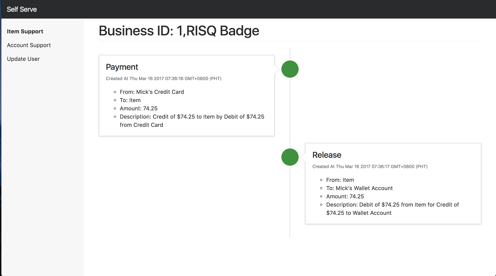
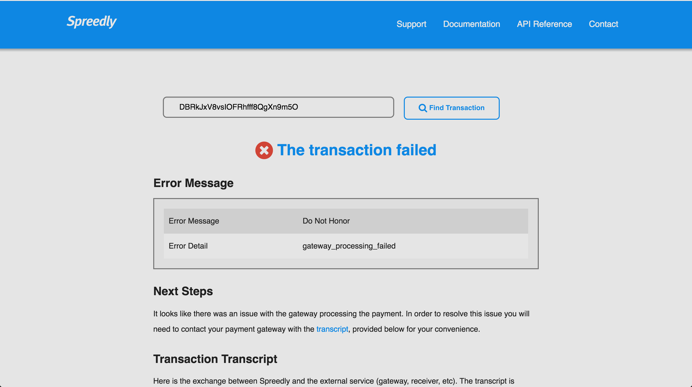

# Dev Support Analysis

## How I saw dev support before (Personal POV):
- Support tickets felt like a chore since you had a deadline to implement your feature
- Never discussed in standups
- Not really prioritized
- No time for investigation (since like I said, you had a feature to ship)

## Problems of dev support:
- *SLOW* - All requests, even simple ones like change email go through tickets (good for devs, bad for ops)

- *BUGS NEVER GET FIXED* - All bugs/fixes discovered need to go through the backlog (which has over a thousand entries) before a developer can get to it

- *DANGEROUS* - Most tasks are accomplished via the rails console (easy to get something wrong, one mistake can cause an outage)

- *NEVER ENOUGH SUPPORT RESOURCE (NO DEDICATED TEAM)* - Devs need an implicit context shift before they can work on a ticket, they needed another one to go back to the feature they're writing

- *BOTTLENECK* - Once a ticket gets more complicated than usual it needs to pass through Andrew (even if you just want to confirm something)

## Types of tickets:
- Internal Task
    * Change email
    * Remove seller fee
    * Everything under common tasks

- Internal Ops Problems
    * Why has the batch not been processed?
    * Can you please check why the funds have not been disbursed to this account?

- External Ops Problems
    * Why is my CC getting declined?
    * Why is my item in payment_pending?

- External Dev Inquiry
    * How do callbacks work?
    * How do we send device id via Android SDK?

- External Dev Problem
    * Your .NET SDK is giving me errors
    * Endpoint X is not working. Was there a recent change to your API?
    * Can we get test cards for the prelive environment

## Solutions
- *SLOW*, *BUGS NEVER GET FIXED*, *DANGEROUS* (Internal Task, Internal Ops Problems, External Ops Problems)
    * Self serve app to do these tasks for them or offer some kind of visualization so they can find the answer themselves
    
    

- *NEVER ENOUGH SUPPORT RESOURCE (NO DEDICATED TEAM)*, *BOTTLENECK* (External Dev Inquiry, External Dev Problem)
    * Dedicated team with lead, standups, own bug queue separate from backlog, able to spend time investigating issues, etc.
